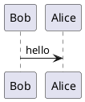

## Basics

### Contribution Basics

For those contributors in the documentation, it cloud be done:

- Directly from Github and making commits. Then, automatically the repository is linked with a continous integration tool ([CircleCI](https://circleci.com/)) that automatically update the gh-pages branch and the visualization

- Making a clone of the repository (using for example [Github Desktop tool](https://desktop.github.com/)) an then, make your changes in a different branch that lately has to be merged with the master branch. Once in the master branch is detected a change, "gh-pages" is directly updated.

### Gitbooks Basics

Gitbooks uses markdown as an style to writing the document:

- [Gitbook Documentation](https://gitbookio.gitbooks.io/documentation/content/)

- [Markdown Cheatsheet](https://github.com/adam-p/markdown-here/wiki/Markdown-Cheatsheet)

To edit markdown files locally, you can use [Atom](https://atom.io/) with the [Markdown viewer plugin](https://github.com/atom/markdown-preview). Moreover, you can also use IntelliJ with the corresponding Markdown viewer or other text editor you like.

### Graphs Basics

For easy integration and modification of the class diagrams, it is used [PlantUML](http://plantuml.com/) and [PlantUML Server](http://www.plantuml.com/plantuml/uml/SyfFKj2rKt3CoKnELR1Io4ZDoSa70000).

For example, given the following diagram code in plantuml:



Every contributor can load the respective generated image from plantuml server:

```markdown

```

Given as a result:


